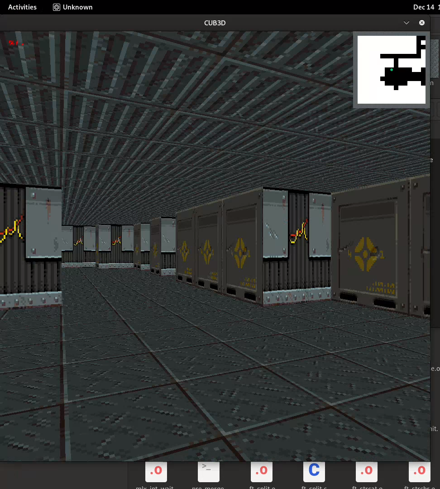

# cub3D

## Overview

cub3D is a project inspired by the iconic Wolfenstein 3D game, widely regarded as the first true First Person Shooter (FPS). The goal of this project is to create a dynamic first-person view of navigating a maze using ray-casting principles, leveraging the miniLibX graphics library.

This project implements all mandatory features and includes all listed bonuses, showcasing advanced capabilities such as animated sprites, minimaps, and more.

This project Only works on Linux because of the MiniLibX Library.

---

## Screenshots




## Features

### Mandatory Features

- Realistic 3D graphical representation of a maze using ray-casting.
- Smooth window management with proper handling of:
  - Switching windows.
  - Minimizing windows.
  - Closing the application using the ESC key or red close button.
- Floor and ceiling colors settable to different RGB values.
- Keyboard controls for movement and view rotation:
  - **W, A, S, D**: Move forward, left, backward, and right.
  - **Left/Right Arrow Keys**: Rotate the view.
- Reads a `.cub` configuration file describing the maze layout and textures:
  - Supported texture identifiers: `NO`, `SO`, `WE`, `EA` for wall textures.
  - Floor (`F`) and Ceiling (`C`) colors specified as RGB values.
  - Player starting position and orientation denoted by `N`, `S`, `E`, or `W`.
  - Map validation ensuring proper structure (e.g., surrounded by walls).
- Utilizes the miniLibX library for rendering.

### Bonus Features

- **Wall Collisions**: Prevents the player from passing through walls.
- **Minimap System**: Displays a real-time minimap of the maze.
- **Interactive Doors**: Doors that can open and close during gameplay.
- **Animated Sprites**: Adds dynamic elements to enhance immersion.
- **Mouse Controls**: Rotate the point of view using the mouse.
- **Additional Enhancements**:
  - Floor and ceiling textures.
  - Heads-Up Display (HUD) with a health bar.
  - Shadow effects for added realism.
  - Weapon systems with shooting capabilities.

---

## How to Use

### Prerequisites

- C compiler (e.g., `gcc`).
- miniLibX library installed on your system.
- Make sure the project follows the [42 Norm](https://github.com/42School/norminette).

### Compilation

Run the following command to compile the project:

```bash
make
```

### Running the Program

To run the program, provide a valid `.cub` map file:

```bash
./cub3D path_to_map_file.cub
```

### Controls

- **W, A, S, D**: Movement keys.
- **Left/Right Arrows**: Rotate the view.
- **ESC**: Exit the game.
- **Mouse**: Rotate the view.
- Interact with doors using the designated key.

---

## File Structure

- **Mandatory Files**:
  - Source files for core functionality.
  - `.cub` map parser.
  - Ray-casting implementation.
- **Bonus Files**:
  - Extended features such as minimap, animations, and mouse controls.

---

## Example Map

Example `.cub` configuration file:

```
NO ./path_to_north_texture.xpm
SO ./path_to_south_texture.xpm
WE ./path_to_west_texture.xpm
EA ./path_to_east_texture.xpm
F 220,100,0
C 225,30,0

111111
100101
101001
1100N1
111111
```

---


## Acknowledgments

- Inspired by Wolfenstein 3D developed by id Software.
- Leveraged miniLibX library for graphics rendering.

---

## Credits

- Developed as part of the 42 School curriculum.
